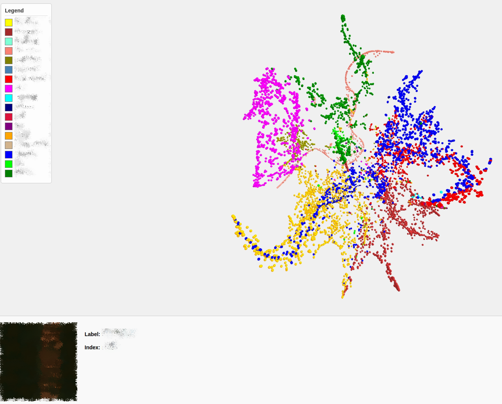

# Interactivte 3D TSNE visualization 

An interactive web-based tool for visualizing high-dimensional features (e.g., deep‐learning embeddings or softmax outputs) using 3D t-SNE.  
Users can rotate, zoom, and click on individual points to view the corresponding original image.  
This repository provides both a FastAPI backend (Python) that computes t-SNE and serves image files, and a minimal front-end (HTML + Three.js) for rendering the 3D scatter plot.  



## Table of Contents

- [Interactivte 3D TSNE visualization](#interactivte-3d-tsne-visualization)
  - [Table of Contents](#table-of-contents)
  - [Prerequisites](#prerequisites)
  - [Usage](#usage)
  - [Data Preparation](#data-preparation)

---

## Prerequisites

- `Python 3.8+` 
- `fastapi`
- `numpy` 
- `scikit-learn` 
- `uvicorn`

---

## Usage

1. **Clone this repository**  
   ```bash
   git clone https://github.com/soribido/3D-TSNE-web-visualization.git
   cd 3D-TSNE-web-visualization
   ```

2. **Create & activate a virtual environment** (recommended)  
   ```bash
   conda activate venv # (your environment)
   ```

3. **Prepare pickle file**  (Refer to [Data Preparation](#data-preparation))
   ```bash
   python -c "import fastapi, numpy, sklearn; print('Dependencies OK!')"
   ```

4. **Run server**  
   ```bash
   python main.py
   ```

5. **Interact with the Visualization**

* On the 3D t-SNE plot in your browser:

  * Use the **mouse wheel (scroll)** to rotate and zoom the plot.

  * **Click** on any point to display its corresponding image in the bottom-left corner.

---

## Data Preparation

Before running the server, you must create a pickle file that contains:

1. **`features`**: A `List[List[float]]` of shape `(N_samples, D_features)`  
2. **`labels`**: A `List[str]` of length `N_samples`, one string label per feature  
3. **`image_paths`**: A `List[str]` of length `N_samples`, each entry being an “absolute file path” to that sample’s image on your filesystem  

You can use the provided `save_data.py` script as a template. For example:

```python
# save_data.py
import os
import pickle

# 1) Specify the base folder containing your images
base_folder = "/home/user/dataset/images"

# 2) Collect all image filenames (e.g., .jpg/.png)
filenames = [
    fname for fname in os.listdir(base_folder)
    if fname.lower().endswith((".jpg", ".jpeg", ".png", ".bmp", ".tif", ".tiff"))
]

# 3) Example: Dummy features & labels
# In practice, you should replace this with your actual feature-extraction pipeline.
features = [
    [0.1, 0.9, 0.0],  # Example 3-dim softmax output or embedding
    [0.3, 0.1, 0.6],
    # …
]
labels = [
    "cat", 
    "dog",
    # …
]

# 4) Build absolute paths (must correspond 1:1 with `features` and `labels`)
assert len(features) == len(labels) == len(filenames), "All three lists must have equal length."

image_paths = [
    os.path.abspath(os.path.join(base_folder, fname))
    for fname in filenames
]

# 5) Dump to pickle
data = {
    "features": features,
    "labels": labels,
    "image_paths": image_paths
}
with open("saved_features_with_abs_paths.pickle", "wb") as f:
    pickle.dump(data, f)

print("Pickle saved to: saved_features_with_abs_paths.pickle")
```

- Rename or move `saved_features_with_abs_paths.pickle` into the root of this project.  
- Confirm that Python can read each absolute path and load the image file (e.g., `os.path.isfile(path)` returns `True`).  

---